# GLFW Architecture Notes For Zing

This document explains GLFW 3.4 as vendored in this repository under
`vendor/glfw`, and how this engine builds and calls it from Zig.

It is written top-down: first the mental model, then the source layout, then
the runtime flows. If you read it once in order, the goal is that every source
file has an obvious place in the system.

## Documentation Read

This was built from the latest GLFW documentation index and the linked pages:

- `https://www.glfw.org/docs/latest/`
- `news.html`
- `quick_guide.html`
- `intro_guide.html`
- `window_guide.html`
- `context_guide.html`
- `vulkan_guide.html`
- `monitor_guide.html`
- `input_guide.html`
- `compile_guide.html`
- `build_guide.html`
- `modules.html`
- `compat_guide.html`
- `moving_guide.html`
- `download.html`
- `community.html`
- `https://github.com/glfw/glfw`

The documentation describes GLFW as a small cross-platform C library for:

- initialization and error handling
- window creation and window events
- OpenGL / OpenGL ES context creation
- Vulkan loader and surface integration
- monitor enumeration and video modes
- keyboard, mouse, joystick, clipboard, timer, and path-drop input
- platform selection and native access

The vendored source is GLFW 3.4.

## The One-Screen Model

GLFW is not a large object graph. It is mostly:

1. A public C API in `include/GLFW/glfw3.h`.
2. Shared platform-independent implementation files in `src/*.c`.
3. A single global library state called `_glfw`.
4. One selected platform backend stored as a function table called
   `_glfw.platform`.
5. Platform-specific files that fill that function table for Win32, Cocoa,
   X11, Wayland, or Null.

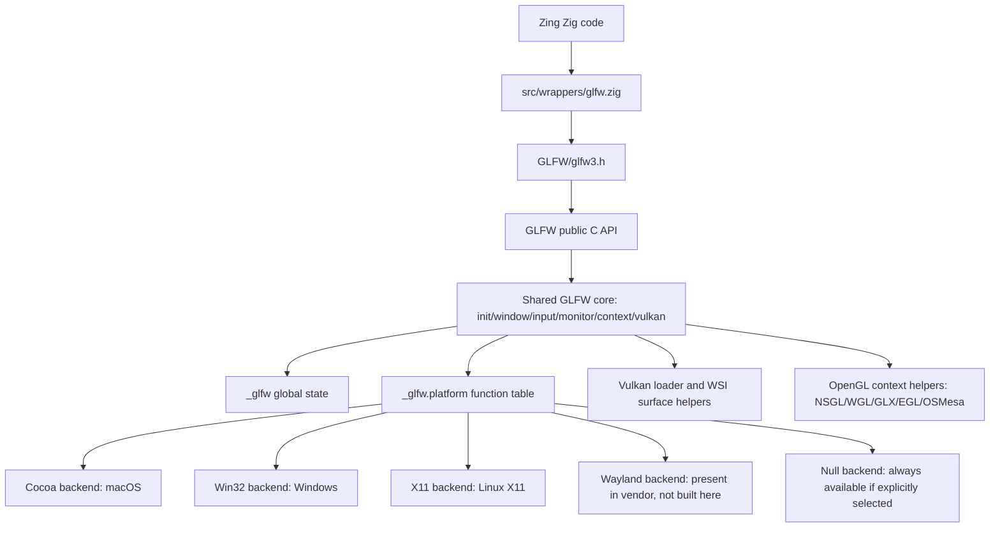

In Zing, GLFW is not used as a package dependency anymore. `build.zig`
compiles selected GLFW C and Objective-C files directly into the `zing`
executable.

## Public API Domains

The public header exposes opaque handles:

```c
typedef struct GLFWwindow GLFWwindow;
typedef struct GLFWmonitor GLFWmonitor;
typedef struct GLFWcursor GLFWcursor;
```

Those are opaque to applications, but internally they are `_GLFWwindow`,
`_GLFWmonitor`, and `_GLFWcursor` from `src/internal.h`.

The public API is organized around these domains:

| Domain | Main public functions | Shared implementation |
| --- | --- | --- |
| Library lifecycle | `glfwInit`, `glfwTerminate`, `glfwInitHint`, `glfwGetError` | `src/init.c` |
| Platform selection | `glfwGetPlatform`, `glfwPlatformSupported` | `src/platform.c` |
| Windows and events | `glfwCreateWindow`, `glfwDestroyWindow`, `glfwPollEvents` | `src/window.c` |
| OpenGL contexts | `glfwMakeContextCurrent`, `glfwSwapBuffers`, proc lookup | `src/context.c`, plus context backends |
| Vulkan | `glfwGetRequiredInstanceExtensions`, `glfwGetInstanceProcAddress`, `glfwCreateWindowSurface` | `src/vulkan.c` |
| Monitors | `glfwGetMonitors`, `glfwGetVideoModes`, gamma ramp | `src/monitor.c` |
| Input | keys, mouse, cursors, joystick, clipboard, timer | `src/input.c`, platform window files |
| Native access | `glfwGetWin32Window`, `glfwGetCocoaWindow`, etc. | `include/GLFW/glfw3native.h` plus backend files |

The docs emphasize two important API rules:

- Events must be pumped with `glfwPollEvents`, `glfwWaitEvents`, or
  `glfwWaitEventsTimeout`.
- Vulkan has no GLFW context. A Vulkan window must be created with
  `GLFW_CLIENT_API` set to `GLFW_NO_API`.

That is exactly what Zing's wrapper does when creating a Vulkan window.

## Vendored Source Layout

The vendored files fall into a few groups.

```text
vendor/glfw/include/GLFW/glfw3.h
vendor/glfw/include/GLFW/glfw3native.h
vendor/glfw/include/vulkan/vulkan.h

vendor/glfw/src/internal.h
vendor/glfw/src/platform.h
vendor/glfw/src/platform.c

vendor/glfw/src/init.c
vendor/glfw/src/window.c
vendor/glfw/src/input.c
vendor/glfw/src/monitor.c
vendor/glfw/src/context.c
vendor/glfw/src/vulkan.c

vendor/glfw/src/cocoa_*.m / cocoa_*.c / cocoa_*.h
vendor/glfw/src/win32_*.c / win32_*.h
vendor/glfw/src/x11_*.c / x11_*.h
vendor/glfw/src/wl_*.c / wl_*.h
vendor/glfw/src/null_*.c / null_*.h

vendor/glfw/src/nsgl_context.m
vendor/glfw/src/wgl_context.c
vendor/glfw/src/glx_context.c
vendor/glfw/src/egl_context.c
vendor/glfw/src/osmesa_context.c

vendor/glfw/src/posix_*.c / posix_*.h
vendor/glfw/src/linux_joystick.c / linux_joystick.h
vendor/glfw/src/xkb_unicode.c / xkb_unicode.h
vendor/glfw/src/mappings.h
```

Think of the source layout as three rings:

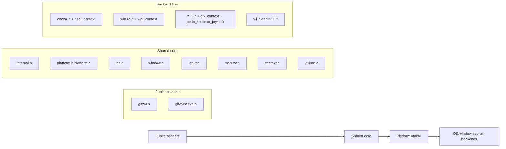

## The Global State

GLFW keeps all mutable shared state in one global variable:

```c
_GLFWlibrary _glfw = { GLFW_FALSE };
```

The `_GLFWlibrary` struct in `src/internal.h` contains:

- `initialized`
- the active `GLFWallocator`
- the selected `_GLFWplatform` vtable
- stored init, window, framebuffer, context, and refresh-rate hints
- linked lists of windows and cursors
- monitor array
- joystick state and gamepad mappings
- TLS slots for per-thread error and current context
- timer state
- EGL state
- OSMesa state
- Vulkan loader and extension state
- global callbacks
- platform-specific library state blocks from `platform.h`

```mermaid
flowchart TD
    GLFW[_glfw: _GLFWlibrary]
    GLFW --> InitState[initialized + allocator]
    GLFW --> Hints[init/window/context/framebuffer hints]
    GLFW --> Platform[_GLFWplatform selected backend]
    GLFW --> Windows[windowListHead]
    GLFW --> Cursors[cursorListHead]
    GLFW --> Monitors[monitors + monitorCount]
    GLFW --> Joysticks[joysticks + mappings]
    GLFW --> TLS[errorSlot + contextSlot + errorLock]
    GLFW --> Timer[timer state]
    GLFW --> Vulkan[vk loader/extensions]
    GLFW --> GLState[EGL/OSMesa/context backend state]
    GLFW --> NativeState[backend-specific library state]
```

The public opaque handles are pointers into objects owned by this state:

- `GLFWwindow*` is `_GLFWwindow*`
- `GLFWmonitor*` is `_GLFWmonitor*`
- `GLFWcursor*` is `_GLFWcursor*`

Applications never see the fields.

## The Platform Vtable

The cross-platform design is centered on this internal struct:

```c
struct _GLFWplatform
{
    int platformID;

    GLFWbool (*init)(void);
    void (*terminate)(void);

    void (*getCursorPos)(_GLFWwindow*,double*,double*);
    void (*setCursorPos)(_GLFWwindow*,double,double);
    void (*setCursorMode)(_GLFWwindow*,int);
    void (*setRawMouseMotion)(_GLFWwindow*,GLFWbool);
    GLFWbool (*rawMouseMotionSupported)(void);
    GLFWbool (*createCursor)(_GLFWcursor*,const GLFWimage*,int,int);
    GLFWbool (*createStandardCursor)(_GLFWcursor*,int);
    void (*destroyCursor)(_GLFWcursor*);
    void (*setCursor)(_GLFWwindow*,_GLFWcursor*);
    const char* (*getScancodeName)(int);
    int (*getKeyScancode)(int);
    void (*setClipboardString)(const char*);
    const char* (*getClipboardString)(void);
    GLFWbool (*initJoysticks)(void);
    void (*terminateJoysticks)(void);
    GLFWbool (*pollJoystick)(_GLFWjoystick*,int);
    const char* (*getMappingName)(void);
    void (*updateGamepadGUID)(char*);

    void (*freeMonitor)(_GLFWmonitor*);
    void (*getMonitorPos)(_GLFWmonitor*,int*,int*);
    void (*getMonitorContentScale)(_GLFWmonitor*,float*,float*);
    void (*getMonitorWorkarea)(_GLFWmonitor*,int*,int*,int*,int*);
    GLFWvidmode* (*getVideoModes)(_GLFWmonitor*,int*);
    GLFWbool (*getVideoMode)(_GLFWmonitor*,GLFWvidmode*);
    GLFWbool (*getGammaRamp)(_GLFWmonitor*,GLFWgammaramp*);
    void (*setGammaRamp)(_GLFWmonitor*,const GLFWgammaramp*);

    GLFWbool (*createWindow)(_GLFWwindow*,const _GLFWwndconfig*,const _GLFWctxconfig*,const _GLFWfbconfig*);
    void (*destroyWindow)(_GLFWwindow*);
    void (*setWindowTitle)(_GLFWwindow*,const char*);
    void (*setWindowIcon)(_GLFWwindow*,int,const GLFWimage*);
    void (*getWindowPos)(_GLFWwindow*,int*,int*);
    void (*setWindowPos)(_GLFWwindow*,int,int);
    void (*getWindowSize)(_GLFWwindow*,int*,int*);
    void (*setWindowSize)(_GLFWwindow*,int,int);
    void (*setWindowSizeLimits)(_GLFWwindow*,int,int,int,int);
    void (*setWindowAspectRatio)(_GLFWwindow*,int,int);
    void (*getFramebufferSize)(_GLFWwindow*,int*,int*);
    void (*getWindowFrameSize)(_GLFWwindow*,int*,int*,int*,int*);
    void (*getWindowContentScale)(_GLFWwindow*,float*,float*);
    void (*iconifyWindow)(_GLFWwindow*);
    void (*restoreWindow)(_GLFWwindow*);
    void (*maximizeWindow)(_GLFWwindow*);
    void (*showWindow)(_GLFWwindow*);
    void (*hideWindow)(_GLFWwindow*);
    void (*requestWindowAttention)(_GLFWwindow*);
    void (*focusWindow)(_GLFWwindow*);
    void (*setWindowMonitor)(_GLFWwindow*,_GLFWmonitor*,int,int,int,int,int);
    GLFWbool (*windowFocused)(_GLFWwindow*);
    GLFWbool (*windowIconified)(_GLFWwindow*);
    GLFWbool (*windowVisible)(_GLFWwindow*);
    GLFWbool (*windowMaximized)(_GLFWwindow*);
    GLFWbool (*windowHovered)(_GLFWwindow*);
    GLFWbool (*framebufferTransparent)(_GLFWwindow*);
    float (*getWindowOpacity)(_GLFWwindow*);
    void (*setWindowResizable)(_GLFWwindow*,GLFWbool);
    void (*setWindowDecorated)(_GLFWwindow*,GLFWbool);
    void (*setWindowFloating)(_GLFWwindow*,GLFWbool);
    void (*setWindowOpacity)(_GLFWwindow*,float);
    void (*setWindowMousePassthrough)(_GLFWwindow*,GLFWbool);
    void (*pollEvents)(void);
    void (*waitEvents)(void);
    void (*waitEventsTimeout)(double);
    void (*postEmptyEvent)(void);

    EGLenum (*getEGLPlatform)(EGLint**);
    EGLNativeDisplayType (*getEGLNativeDisplay)(void);
    EGLNativeWindowType (*getEGLNativeWindow)(_GLFWwindow*);

    void (*getRequiredInstanceExtensions)(char**);
    GLFWbool (*getPhysicalDevicePresentationSupport)(VkInstance,VkPhysicalDevice,uint32_t);
    VkResult (*createWindowSurface)(VkInstance,_GLFWwindow*,const VkAllocationCallbacks*,VkSurfaceKHR*);
};
```

This is the core architectural move. Public functions do shared validation and
state management, then call through `_glfw.platform`.

For example:

```c
GLFWAPI void glfwPollEvents(void)
{
    _GLFW_REQUIRE_INIT();
    _glfw.platform.pollEvents();
}
```

And Vulkan surface creation ends at:

```c
return _glfw.platform.createWindowSurface(instance, window, allocator, surface);
```

## Platform Selection

GLFW 3.4 supports runtime platform selection, but only among platforms compiled
into the binary. The file `src/platform.c` builds a static list:

```c
static const struct
{
    int ID;
    GLFWbool (*connect)(int,_GLFWplatform*);
} supportedPlatforms[] =
{
#if defined(_GLFW_WIN32)
    { GLFW_PLATFORM_WIN32, _glfwConnectWin32 },
#endif
#if defined(_GLFW_COCOA)
    { GLFW_PLATFORM_COCOA, _glfwConnectCocoa },
#endif
#if defined(_GLFW_WAYLAND)
    { GLFW_PLATFORM_WAYLAND, _glfwConnectWayland },
#endif
#if defined(_GLFW_X11)
    { GLFW_PLATFORM_X11, _glfwConnectX11 },
#endif
};
```

Then `_glfwSelectPlatform` chooses one of them and fills `_glfw.platform`.

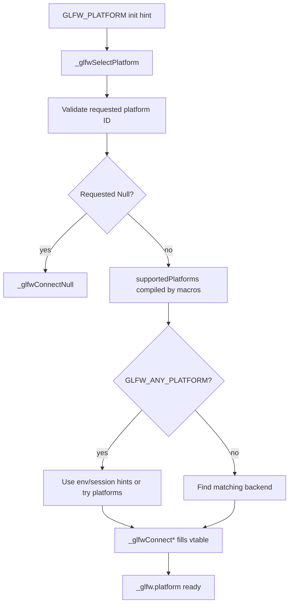

Important consequences:

- If no `_GLFW_WIN32`, `_GLFW_COCOA`, `_GLFW_WAYLAND`, or `_GLFW_X11` macro is
  defined while compiling `platform.c`, the binary only supports Null.
- The Null backend is special: it is not in `supportedPlatforms`, but it can be
  selected explicitly.
- `platform.c` and the common source files must be compiled with the same
  `_GLFW_*` platform macro as the backend files.

This is why Zing previously hit:

```text
This binary only supports the Null platform
```

That happens when backend source files are present, but `platform.c` was
compiled without the platform macro that exposes them to the selector.

## How Zing Builds GLFW

Zing's `build.zig` avoids GLFW's CMake build and compiles source files directly.

Common files are always compiled:

```zig
const glfw_common_sources = [_][]const u8{
    "vendor/glfw/src/context.c",
    "vendor/glfw/src/init.c",
    "vendor/glfw/src/input.c",
    "vendor/glfw/src/monitor.c",
    "vendor/glfw/src/platform.c",
    "vendor/glfw/src/vulkan.c",
    "vendor/glfw/src/window.c",
    "vendor/glfw/src/egl_context.c",
    "vendor/glfw/src/osmesa_context.c",
    "vendor/glfw/src/null_init.c",
    "vendor/glfw/src/null_monitor.c",
    "vendor/glfw/src/null_window.c",
    "vendor/glfw/src/null_joystick.c",
};
```

Then one OS backend group is added.

macOS:

```zig
const flags = &.{
    "-std=c99",
    "-D_GLFW_COCOA",
    b.fmt("-D_GLFW_VULKAN_LIBRARY=\"{s}\"", .{vulkan_library}),
};
```

```zig
const glfw_macos_sources = [_][]const u8{
    "vendor/glfw/src/cocoa_time.c",
    "vendor/glfw/src/posix_module.c",
    "vendor/glfw/src/posix_thread.c",
    "vendor/glfw/src/cocoa_init.m",
    "vendor/glfw/src/cocoa_joystick.m",
    "vendor/glfw/src/cocoa_monitor.m",
    "vendor/glfw/src/cocoa_window.m",
    "vendor/glfw/src/nsgl_context.m",
};
```

Windows:

```zig
const flags = &.{ "-std=c99", "-D_GLFW_WIN32" };
```

```zig
const glfw_windows_sources = [_][]const u8{
    "vendor/glfw/src/win32_init.c",
    "vendor/glfw/src/win32_joystick.c",
    "vendor/glfw/src/win32_module.c",
    "vendor/glfw/src/win32_monitor.c",
    "vendor/glfw/src/win32_thread.c",
    "vendor/glfw/src/win32_time.c",
    "vendor/glfw/src/win32_window.c",
    "vendor/glfw/src/wgl_context.c",
};
```

Linux X11:

```zig
const flags = &.{ "-std=c99", "-D_GLFW_X11" };
```

```zig
const glfw_linux_x11_sources = [_][]const u8{
    "vendor/glfw/src/posix_module.c",
    "vendor/glfw/src/posix_poll.c",
    "vendor/glfw/src/posix_thread.c",
    "vendor/glfw/src/posix_time.c",
    "vendor/glfw/src/linux_joystick.c",
    "vendor/glfw/src/x11_init.c",
    "vendor/glfw/src/x11_monitor.c",
    "vendor/glfw/src/x11_window.c",
    "vendor/glfw/src/xkb_unicode.c",
    "vendor/glfw/src/glx_context.c",
};
```

The platform macro is deliberately applied to both common and platform files.
That makes `platform.c`, `platform.h`, `internal.h`, and the backend files
agree on which backend exists.

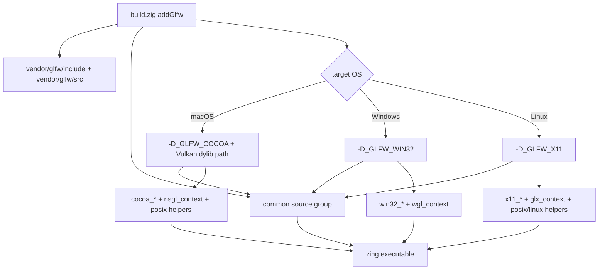

### What Is Present But Not Built

The vendored tree contains Wayland files:

```text
wl_init.c
wl_monitor.c
wl_window.c
wl_platform.h
```

Zing's current `build.zig` does not compile them. Linux builds use X11 only.

To add Wayland later, you would need to compile the Wayland files, define
`_GLFW_WAYLAND`, add generated protocol sources if required by GLFW's normal
build, and link the required Wayland/XKB/libdecor dependencies. Do not just add
the `.c` files without the dependency story; Wayland support is more involved
than the current X11-only path.

## How `platform.h` Builds Cross-Platform Structs

`src/platform.h` is the macro composition layer. It includes platform headers
based on `_GLFW_*` macros and defines empty state blocks for platforms that are
not compiled.

For example, when `_GLFW_COCOA` is defined:

```c
#if defined(_GLFW_COCOA)
 #include "cocoa_platform.h"
 #define GLFW_EXPOSE_NATIVE_COCOA
 #define GLFW_EXPOSE_NATIVE_NSGL
#else
 #define GLFW_COCOA_WINDOW_STATE
 #define GLFW_COCOA_MONITOR_STATE
 #define GLFW_COCOA_CURSOR_STATE
 #define GLFW_COCOA_LIBRARY_WINDOW_STATE
 #define GLFW_NSGL_CONTEXT_STATE
 #define GLFW_NSGL_LIBRARY_CONTEXT_STATE
#endif
```

Then it composes internal structs:

```c
#define GLFW_PLATFORM_WINDOW_STATE \
        GLFW_WIN32_WINDOW_STATE \
        GLFW_COCOA_WINDOW_STATE \
        GLFW_WAYLAND_WINDOW_STATE \
        GLFW_X11_WINDOW_STATE \
        GLFW_NULL_WINDOW_STATE
```

`_GLFWwindow` contains:

```c
GLFW_PLATFORM_WINDOW_STATE
```

That means `_GLFWwindow` always has slots for the active backend, while inactive
backends contribute empty macros.

This is how one internal struct can support every OS without C inheritance or
per-platform wrapper objects.

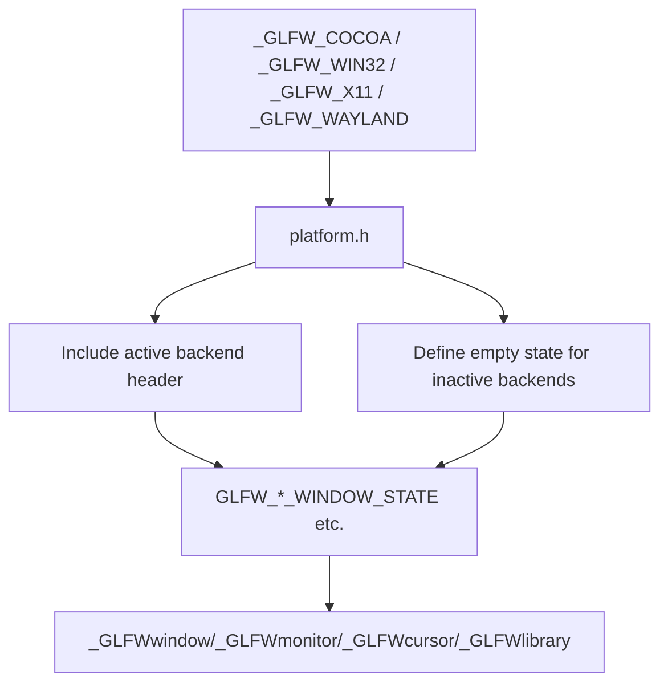

## Initialization Flow

`glfwInit` lives in `src/init.c`. At a high level it:

1. Copies init hints into `_glfw.hints.init`.
2. Selects a platform with `_glfwSelectPlatform`.
3. Creates TLS and mutex objects.
4. Initializes the platform.
5. Initializes timers, default window hints, gamepad mappings, monitors, and
   other library state.
6. Marks `_glfw.initialized = GLFW_TRUE`.

Errors are stored per thread and can also be delivered through the error
callback.

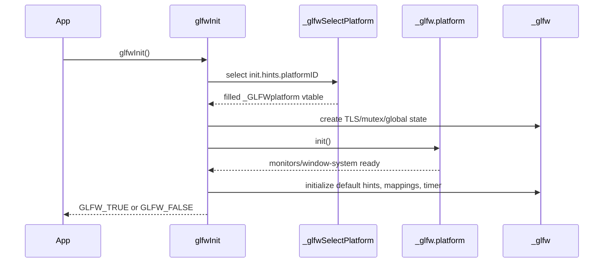

Termination reverses this:

1. Destroy remaining windows.
2. Destroy remaining cursors.
3. Restore monitor gamma ramps.
4. Free monitors and gamepad mappings.
5. Terminate Vulkan.
6. Terminate joystick and platform systems.
7. Destroy TLS and mutex objects.
8. Zero `_glfw`.

## Window Creation Flow

The public `glfwCreateWindow` in `src/window.c` is mostly shared logic:

1. Require initialized GLFW.
2. Validate size.
3. Copy the current hints into local configs:
   - `_GLFWfbconfig`
   - `_GLFWctxconfig`
   - `_GLFWwndconfig`
4. Allocate `_GLFWwindow`.
5. Link it into `_glfw.windowListHead`.
6. Initialize shared window state.
7. Call `_glfw.platform.createWindow`.

```mermaid
flowchart TD
    Public[glfwCreateWindow] --> Require[_GLFW_REQUIRE_INIT]
    Require --> CopyHints[Copy framebuffer/context/window hints]
    CopyHints --> ValidateContext[_glfwIsValidContextConfig]
    ValidateContext --> Allocate[Allocate _GLFWwindow]
    Allocate --> Link[Link into _glfw.windowListHead]
    Link --> SharedState[Fill common window state]
    SharedState --> Backend[_glfw.platform.createWindow]
    Backend --> Native[Create NSWindow/HWND/X11 Window/etc.]
    Backend --> OptionalContext[Create OpenGL context unless GLFW_NO_API]
    OptionalContext --> Return[Return GLFWwindow*]
```

In Zing's Vulkan path, `src/wrappers/glfw.zig` sets:

```zig
c.glfwWindowHint(c.GLFW_CLIENT_API, @intFromEnum(hints.client_api));
```

and the engine passes `.no_api`, so GLFW creates a native window without an
OpenGL context.

## Window Events And Input Flow

Platform files receive native OS events and translate them into shared GLFW
events. The shared event functions live in `src/input.c` and `src/window.c`.

Examples:

- Cocoa receives `NSEvent` messages in `cocoa_window.m`
- Win32 receives `WM_*` messages in `win32_window.c`
- X11 receives `XEvent` values in `x11_window.c`
- Wayland receives listener callbacks in `wl_window.c`

Each backend normalizes native events by calling functions like:

```c
_glfwInputKey(window, key, scancode, action, mods);
_glfwInputChar(window, codepoint, mods, plain);
_glfwInputMouseClick(window, button, action, mods);
_glfwInputCursorPos(window, xpos, ypos);
_glfwInputScroll(window, xoffset, yoffset);
_glfwInputFramebufferSize(window, width, height);
_glfwInputWindowCloseRequest(window);
```

Those shared functions update state and invoke user callbacks.

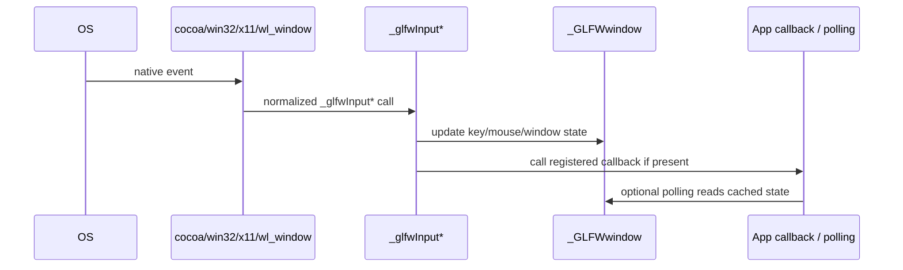

This is why GLFW supports both callbacks and polling for many input types:

- Native events update cached state.
- Callbacks fire during event processing.
- Later polling reads the cached state.

## Context Architecture

GLFW supports OpenGL and OpenGL ES contexts. A context is embedded in
`_GLFWwindow`:

```c
_GLFWcontext context;
```

The context struct contains the common context attributes plus function
pointers:

```c
void (*makeCurrent)(_GLFWwindow*);
void (*swapBuffers)(_GLFWwindow*);
void (*swapInterval)(int);
int (*extensionSupported)(const char*);
GLFWglproc (*getProcAddress)(const char*);
void (*destroy)(_GLFWwindow*);
```

Context backend files fill these pointers:

| Backend | File | Used with |
| --- | --- | --- |
| NSGL | `nsgl_context.m` | macOS native OpenGL |
| WGL | `wgl_context.c` | Windows native OpenGL |
| GLX | `glx_context.c` | X11 native OpenGL |
| EGL | `egl_context.c` | EGL/OpenGL ES paths |
| OSMesa | `osmesa_context.c` | Offscreen software contexts |

Zing currently uses Vulkan, so it asks GLFW for `GLFW_NO_API`. That bypasses
context creation but still uses GLFW for native windows, events, and Vulkan
surface creation.

## Vulkan Architecture

GLFW's Vulkan support is in `src/vulkan.c`.

GLFW does not require linking against the Vulkan loader. It loads the loader
dynamically unless the application provides a loader function with
`glfwInitVulkanLoader`.

Default loader names:

| Platform | Loader |
| --- | --- |
| Windows | `vulkan-1.dll` |
| Linux / Unix | `libvulkan.so.1` |
| macOS | `libvulkan.1.dylib` |

Zing's macOS build passes:

```zig
b.fmt("-D_GLFW_VULKAN_LIBRARY=\"{s}\"", .{vulkan_library})
```

That makes GLFW load the Vulkan SDK's specific `libvulkan.1.dylib` instead of
depending on a global loader path.

Vulkan flow:

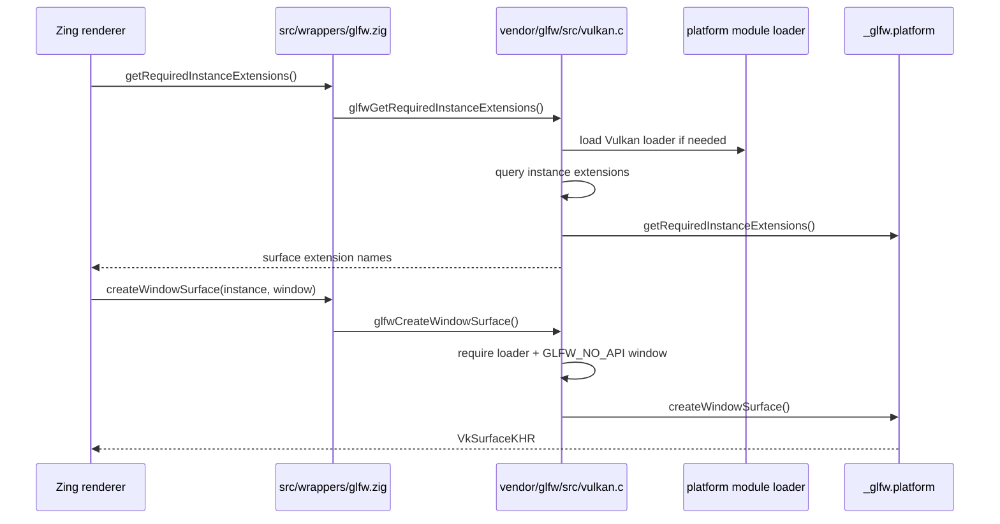

Backend-specific surface creation:

| Platform | Surface extension family |
| --- | --- |
| Win32 | `VK_KHR_win32_surface` |
| Cocoa/macOS | `VK_EXT_metal_surface` or `VK_MVK_macos_surface` depending on available support |
| X11 | `VK_KHR_xcb_surface` or `VK_KHR_xlib_surface` |
| Wayland | `VK_KHR_wayland_surface` |
| Null | no real window surface |

## Monitors

Monitors are represented by `_GLFWmonitor`. Applications do not create them.
The platform backend discovers them and calls shared monitor functions.

Each monitor stores:

- name
- user pointer
- physical size
- current fullscreen window, if any
- supported video modes
- current video mode
- original and current gamma ramps
- backend-specific monitor state

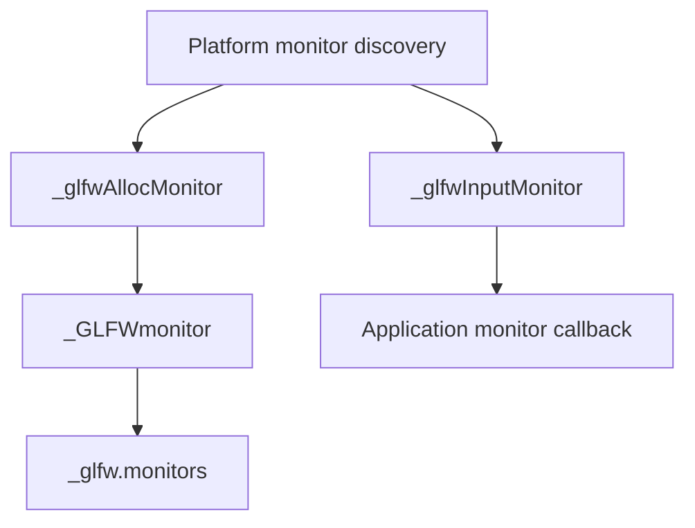

Fullscreen windows are built on monitor ownership: a window can point to a
monitor, and a monitor can track the window whose video mode is current.

## Input, Joysticks, Gamepads, Clipboard, Timer

`src/input.c` covers:

- keyboard state
- text input
- mouse button state
- cursor position and cursor modes
- cursor objects
- joystick state
- gamepad mapping parsing
- clipboard public API dispatch
- timer public API dispatch
- path-drop callback dispatch

Joystick support is initialized on demand in GLFW 3.4. Internally,
`input.c` calls:

```c
_glfw.platform.initJoysticks()
```

only when joystick APIs are first used.

Gamepad mappings come from `src/mappings.h`, which contains SDL-style mapping
strings. `input.c` parses them into `_GLFWmapping` values.

Timers are selected by `platform.h`:

| OS | Timer files |
| --- | --- |
| Windows | `win32_time.c/h` |
| macOS | `cocoa_time.c/h` |
| Other Unix | `posix_time.c/h` |

Thread local storage and mutexes are similarly selected:

| OS | TLS/mutex files |
| --- | --- |
| Windows | `win32_thread.c/h` |
| Non-Windows | `posix_thread.c/h` |

Dynamic module loading is selected as:

| OS | Module loader files |
| --- | --- |
| Windows | `win32_module.c` |
| Non-Windows | `posix_module.c` |

That module layer is used for Vulkan, EGL, OSMesa, and some platform libraries.

## Backend Summaries

### Cocoa / macOS

Files:

```text
cocoa_init.m
cocoa_joystick.m
cocoa_monitor.m
cocoa_window.m
cocoa_platform.h
cocoa_time.c
cocoa_time.h
nsgl_context.m
posix_module.c
posix_thread.c
```

Responsibilities:

- initialize `NSApplication`
- create menus when enabled
- create and manage `NSWindow` / `NSView`
- translate `NSEvent` values into `_glfwInput*`
- enumerate displays through CoreGraphics
- create Vulkan Metal/macOS surfaces
- create NSGL OpenGL contexts if requested
- use POSIX thread and module helpers

Zing links:

```zig
exe.root_module.linkFramework("Cocoa", .{});
exe.root_module.linkFramework("IOKit", .{});
exe.root_module.linkFramework("CoreFoundation", .{});
```

### Win32 / Windows

Files:

```text
win32_init.c
win32_joystick.c
win32_module.c
win32_monitor.c
win32_thread.c
win32_time.c
win32_window.c
win32_platform.h
wgl_context.c
```

Responsibilities:

- register window classes
- create and manage `HWND`
- translate `WM_*` messages into `_glfwInput*`
- enumerate monitors and video modes
- load modules through Win32 APIs
- use Win32 TLS, mutex, and timer APIs
- create Win32 Vulkan surfaces
- create WGL OpenGL contexts if requested

Zing links:

```zig
exe.root_module.linkSystemLibrary("gdi32", .{});
exe.root_module.linkSystemLibrary("user32", .{});
exe.root_module.linkSystemLibrary("shell32", .{});
```

### X11 / Linux

Files currently built by Zing:

```text
x11_init.c
x11_monitor.c
x11_window.c
x11_platform.h
xkb_unicode.c
xkb_unicode.h
glx_context.c
linux_joystick.c
linux_joystick.h
posix_module.c
posix_poll.c
posix_thread.c
posix_time.c
```

Responsibilities:

- connect to Xlib
- create and manage X11 windows
- cooperate with window managers through ICCCM/EWMH conventions
- translate X events into `_glfwInput*`
- handle XKB key translation
- enumerate RandR monitor/output state where available
- create X11 Vulkan surfaces
- create GLX OpenGL contexts if requested
- use POSIX helpers

Zing currently links:

```zig
exe.root_module.linkSystemLibrary("dl", .{});
exe.root_module.linkSystemLibrary("pthread", .{});
exe.root_module.linkSystemLibrary("m", .{});
```

Depending on target environment, X11 builds may also need X11-related system
libraries exposed to Zig's linker. The current cross-build only verifies
compilation paths available to the target, not runtime availability on a Linux
machine.

### Wayland

Files present but not built by Zing:

```text
wl_init.c
wl_monitor.c
wl_window.c
wl_platform.h
```

Responsibilities when enabled:

- connect to Wayland display/compositor
- create Wayland surfaces
- use xdg-shell protocols
- use XKB for keyboard translation
- optionally use libdecor for client-side decorations
- create Wayland Vulkan surfaces

GLFW 3.4 removed the old `GLFW_USE_WAYLAND` option. In the upstream CMake build,
Wayland and X11 can both be built and selected at runtime. Zing's manual build
does not currently reproduce that full Linux dual-backend setup.

### Null

Files:

```text
null_init.c
null_monitor.c
null_window.c
null_joystick.c
null_platform.h
```

The Null backend is useful for tests or headless scenarios. It has no real
native windows. GLFW allows it only when explicitly selected.

Zing compiles the Null files as part of the common group because GLFW's core
expects the Null backend to exist.

## Native Access

`glfw3native.h` exposes escape hatches:

- `glfwGetWin32Window`
- `glfwGetCocoaWindow`
- `glfwGetCocoaView`
- `glfwGetX11Display`
- `glfwGetX11Window`
- `glfwGetWaylandDisplay`
- `glfwGetWaylandWindow`
- context-native access like WGL, NSGL, GLX, EGL, OSMesa

GLFW 3.4 can export native access functions for more than one backend if
multiple backends were compiled in. The docs warn not to infer the active
platform just because a native access function exists. Query the active
platform with `glfwGetPlatform` after initialization.

Zing's wrapper currently does not expose native access APIs.

## Zing's Zig Wrapper

The file `src/wrappers/glfw.zig` is a small typed layer over the C API.

It imports GLFW with Vulkan enabled:

```zig
pub const c = @cImport({
    @cDefine("GLFW_INCLUDE_VULKAN", "1");
    @cInclude("GLFW/glfw3.h");
});
```

It exposes:

- `init`
- `terminate`
- `pollEvents`
- `getTime`
- `getErrorString`
- error callback wiring
- Vulkan helpers:
  - `getRequiredInstanceExtensions`
  - `getInstanceProcAddress`
  - `createWindowSurface`
- `Window`
  - `create`
  - `destroy`
  - `shouldClose`
  - `getAttrib`
  - `getKey`
  - `getFramebufferSize`
  - framebuffer-size callback wiring

The wrapper intentionally narrows GLFW to what the engine uses today.

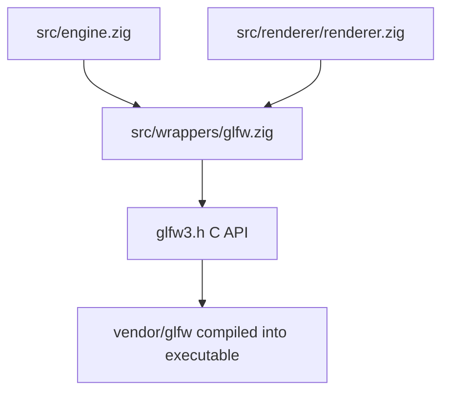

The callback thunks convert C callback shapes into Zig callback shapes:

```zig
fn errorCallbackThunk(error_code: c_int, description: [*c]const u8) callconv(.c) void {
    if (error_callback) |callback| {
        callback(@enumFromInt(error_code), std.mem.span(description));
    }
}
```

This avoids leaking C pointer conventions through the rest of the engine.

## Important Runtime Flows In Zing

### Engine Startup

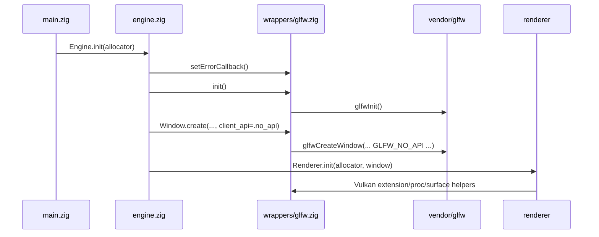

### Frame Loop

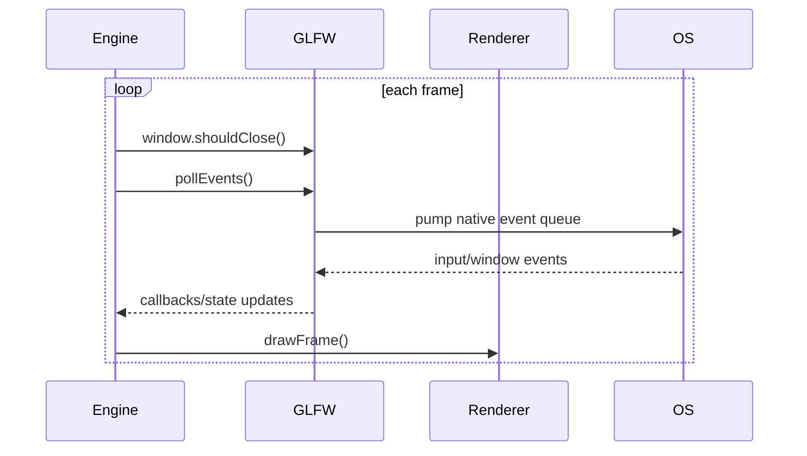

### Shutdown

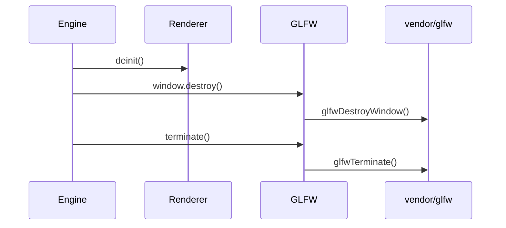

## Threading And Lifetime Rules To Remember

From the GLFW docs:

- Initialization, termination, window creation, event processing, and most
  window APIs are main-thread APIs.
- Vulkan-related GLFW functions may be called from any thread.
- Raw timer functions may be called from any thread.
- The current context and error states are stored per thread.
- GLFW only synchronizes its internal per-thread context and error states.
  Application-level synchronization remains the application's job.
- Event order for related events can differ between platforms.
- Error descriptions are short-lived; copy them if you need to keep them.

For Zing this means:

- Keep GLFW window creation/destruction and event polling on the main thread.
- Treat Vulkan device/renderer synchronization as the renderer's responsibility.
- Do not store raw GLFW error description pointers beyond the callback.

## Why GLFW Looks The Way It Does

The architecture is optimized around a stable C ABI and very low dependency
surface:

- Opaque public pointers hide platform-specific structs.
- One global `_glfw` keeps the C API simple.
- A platform function table avoids scattering `#ifdef` throughout shared public
  APIs.
- `platform.h` macro composition lets shared structs include backend state
  without runtime allocations for wrapper objects.
- Context backends are separate from window-system backends because OpenGL
  context APIs vary independently from event/window APIs.
- Vulkan support is loader-based and surface-focused because Vulkan owns its
  own instance/device/context model.

In short:

```text
public GLFW API
    -> shared validation/state/cache/callback logic
        -> selected platform vtable
            -> OS-specific code
```

That is the mental model to keep in your head while reading any specific file.

## File Map Cheat Sheet

| File | Role |
| --- | --- |
| `include/GLFW/glfw3.h` | Public API declarations, constants, opaque handle types |
| `include/GLFW/glfw3native.h` | Optional native escape-hatch API |
| `src/internal.h` | Internal structs, helpers, global `_glfw` declaration |
| `src/platform.h` | Platform macro composition and backend state inclusion |
| `src/platform.c` | Runtime platform selection |
| `src/init.c` | `glfwInit`, `glfwTerminate`, allocator, errors, UTF-8 helpers |
| `src/window.c` | Window creation, hints, attributes, event polling dispatch |
| `src/input.c` | Input state, callbacks, joystick/gamepad, clipboard/timer dispatch |
| `src/monitor.c` | Monitor arrays, video modes, gamma ramps |
| `src/context.c` | Shared OpenGL/OpenGL ES context behavior |
| `src/vulkan.c` | Vulkan loader, required extensions, surface dispatch |
| `src/cocoa_*` | macOS windowing, monitor, joystick, timer backend |
| `src/win32_*` | Windows windowing, monitor, joystick, timer, module backend |
| `src/x11_*` | Linux X11 windowing and monitor backend |
| `src/wl_*` | Wayland backend, present but not built by Zing |
| `src/null_*` | Headless/null backend |
| `src/nsgl_context.m` | macOS OpenGL context backend |
| `src/wgl_context.c` | Windows OpenGL context backend |
| `src/glx_context.c` | X11 OpenGL context backend |
| `src/egl_context.c` | EGL context backend |
| `src/osmesa_context.c` | OSMesa offscreen context backend |
| `src/posix_*` | POSIX thread/module/poll/time helpers |
| `src/linux_joystick.*` | Linux joystick backend |
| `src/xkb_unicode.*` | XKB key/text translation helper |
| `src/mappings.h` | Built-in gamepad mapping strings |

## Practical Modification Rules For This Repo

When changing the vendored GLFW integration:

1. If adding a platform, define the matching `_GLFW_*` macro for common files
   and backend files.
2. Keep `platform.c` and the backend files compiled with the same platform
   macro set.
3. Add the backend's helper files, not only the obvious `*_window.c`.
4. Link the OS libraries required by that backend.
5. For macOS Vulkan, keep `_GLFW_VULKAN_LIBRARY` pointed at the SDK loader path
   or call `glfwInitVulkanLoader` from the wrapper before `glfwInit`.
6. Keep Zig's wrapper narrow unless the engine actually needs more GLFW API.
7. If exposing native access, also expose `glfwGetPlatform` so callers can check
   which backend is active.

The easiest way to diagnose cross-platform setup mistakes is:

- `This binary only supports the Null platform`: common files were compiled
  without a real `_GLFW_*` platform macro.
- Vulkan loader errors on macOS: GLFW could not load the Vulkan loader dylib or
  the process lacks the right Vulkan SDK/ICD environment.
- Missing symbols at link time: the backend C files were compiled but their OS
  libraries or helper files were not linked.
